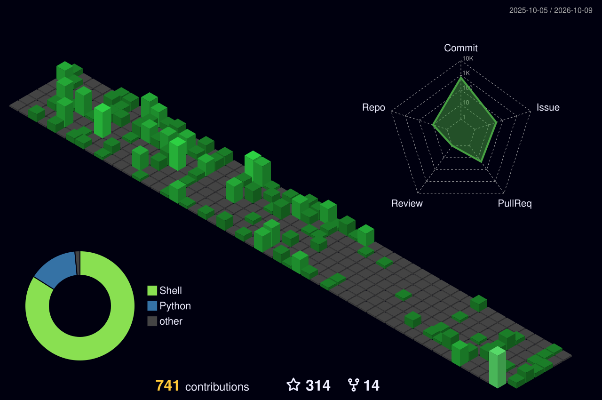

<!-- 🎬 HERO — cyber intro + name.
     Phones get the 720px-wide card: ~2x the rendered text size and almost no
     animation; everything else gets the full 1200px animated reel. -->
<picture>
  <source media="(max-width: 820px)" srcset="./hero-mobile.svg?v=1">
  
</picture>

  

<!-- 👨‍💻 LEFT: what I build   •   🎮 RIGHT: life outside code -->
<picture>
  <source media="(max-width: 820px)" srcset="./about-life-mobile.svg?v=1">
  
</picture>

  

<!-- 🧰 TECH STACK -->
<picture>
  <source media="(max-width: 820px)" srcset="./stack-mobile.svg?v=1">
  
</picture>

  

<!-- 🪪 DEVELOPER ID + DASHBOARD -->
<picture>
  <source media="(max-width: 820px)" srcset="./id-dashboard-mobile.svg?v=1">
  
</picture>

  

## 🧪 Personal builds

*Everything here started as one personal annoyance — then became a repo someone else could use. Stars, forks, pull requests and licences are live counts — tap any card to open the repository.*

<a href="https://github.com/Graywizard888/Enhancify"><picture>
  <source media="(max-width: 820px)" srcset="./builds/p01-mobile.svg?v=1">
  
</picture></a>

<a href="https://github.com/Graywizard888/Terminal_EX"><picture>
  <source media="(max-width: 820px)" srcset="./builds/p02-mobile.svg?v=1">
  
</picture></a>

<a href="https://github.com/Graywizard888/GPlayDL-TUI"><picture>
  <source media="(max-width: 820px)" srcset="./builds/p03-mobile.svg?v=1">
  
</picture></a>

<a href="https://github.com/Graywizard888/Gists_Collection"><picture>
  <source media="(max-width: 820px)" srcset="./builds/p04-mobile.svg?v=1">
  
</picture></a>

<a href="https://github.com/Graywizard888/Gemini-Setup"><picture>
  <source media="(max-width: 820px)" srcset="./builds/p05-mobile.svg?v=1">
  
</picture></a>

<a href="https://github.com/Graywizard888/Extension_Fetcher"><picture>
  <source media="(max-width: 820px)" srcset="./builds/p06-mobile.svg?v=1">
  
</picture></a>

<a href="https://github.com/Graywizard888/Claude_code_setup"><picture>
  <source media="(max-width: 820px)" srcset="./builds/p07-mobile.svg?v=1">
  
</picture></a>

 

## 🌆 My contribution city

*Every commit builds another tower — rebuilt automatically every day.*

  

<!-- 💌 LET'S CONNECT -->
<picture>
  <source media="(max-width: 820px)" srcset="./connect-mobile.svg?v=1">
  
</picture>

  

 

**Build. Break. Rebuild. Optimize.** 💚

